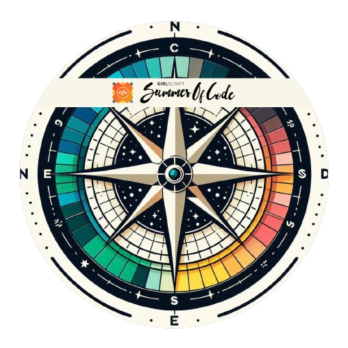

<!-- Hero Banner -->

 
 

 

<!-- Profile Views -->

 

<!-- ================== GITHUB STATS ================== -->

<h3 align="center">Languages and Tools:</h3>

          

<h3 align="center">My Badges:</h3>

  
  
  
  
  
  

 
 

 

  

    
  

 

